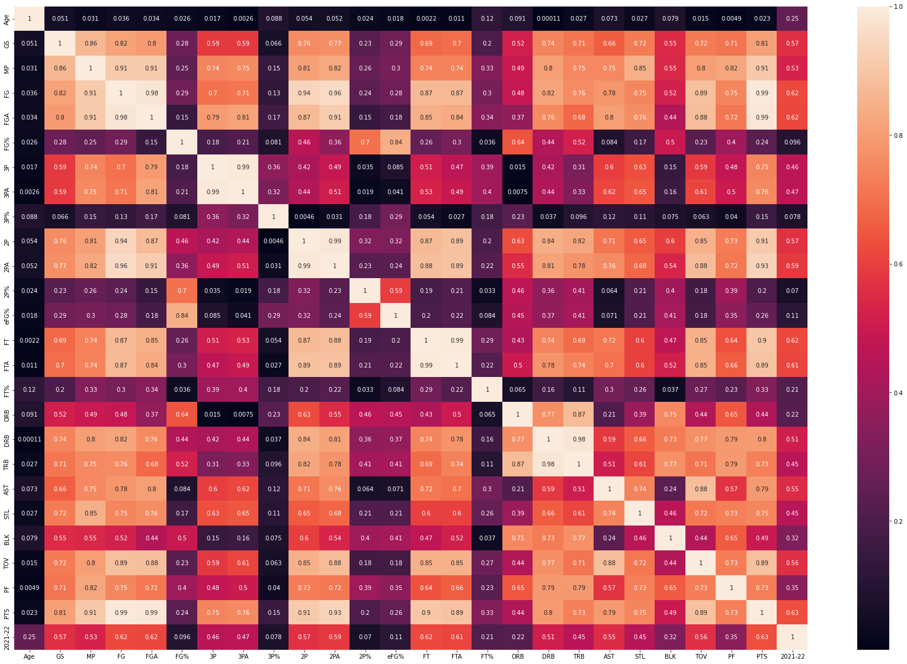

# NBA Salary Deep Learning

A personal project that encompasses NBA data scraping, data cleaning, data transformation, and a neural network model.

Disclaimer: Data is graciously and thankfully scraped from [Basketball Reference](https://www.basketball-reference.com). They're the best!

## Getting Started

The `Scraping` Jupyter notebook contains all the necessary code for scraping data from [Basketball Reference](https://www.basketball-reference.com).

The `NBASalaries` Jupyter notebook contains everything else - cleaning, transformation, and the model.

## Model Features, Correlation Matrix, and Some Comments

The model has the following features:

    - FG: Field goals
    - FGA: Field goals attempted
    - FT: Free throws
    - FTA: Free throws attempted
    - PTS: Points
    - AST: Assists
    - TOV: Turnovers
    - 2P: 2-pointers
    - 2PA: 2-pointers attempted
    - GS: Games started
    - MP: Minutes played

Something that stood out to me at first, but made more sense when I thought about it was the low(-er) correlation between salary and 3-pointers. When you think about it, players like Jokic + Gobert + Embiid hardly take that many 3-pointers, but are among the highest paid NBA players.

This is the correlation matrix (_2021-22 is the salary variable_):

